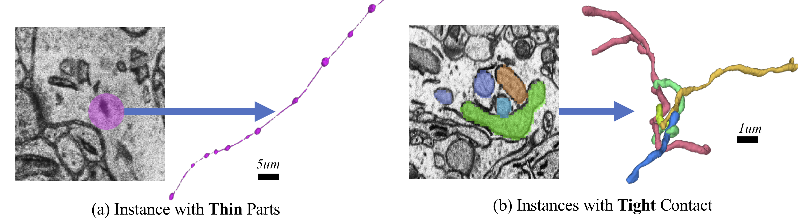

CT Fly Segmentation
===========================

Introduction
-------------

Indirect flight muscles (IFMs) in adult Drosophila provide the key power stroke for wing beating. They also serve as a valuable model for studying muscle
development. Such analyses are impeded by conventional histological
preparations and imaging techniques that limit exact morphometry of flight
muscles. In this tutorial, microCT scanning is employed on a tissue preparation
that retains muscle morphology under homeostatic conditions. Focusing on
a subset of IFMs called the dorsal longitudinal muscles (DLMs), it is found that
DLM volumes increase with age, partially due to the increased separation
between myofibrillar fascicles, in a sex-dependentmanner.The authors have uncovered
and quantified asymmetry in the size of these muscles on either side of the
longitudinal midline.Measurements of this resolution and scalemake substantive
studies that test the connection between form and function possible.

In this tutorial, you will learn how to predict the **Drosophila longitudinal muscles instance masks** on the CT Fly
dataset released by Chaturvedi, et al. in 2019.

Volumetric Instance Segmentation
----------------------

This section provides step-by-step guidance for CT Fly segmentation with the datasets released by Chaturvedi et al. 
We consider consider the task as 3D **instance segmentation** and predict the Drosophila longitudinal muscles instances with encoder-decoder ConvNets ``unet_res_3d``, similar to the one used in `neuron segmentation <https://zudi-lin.github.io/pytorch_connectomics/build/html/tutorials/snemi.html>`_.
The evaluation of the segmentation results is based on the F1-score.
.. note::
    The dataset released by Chaturvedi et al. is completely different from other EM connectomics datasets used in the tutorials, 
    where we downsample the volumes to (112,112,112) to capture the whole feild of view instead of patches of volumes.
    Therefore a completely different Dataloader and preprocessing steps are preferred.

All the scripts needed for this tutorial can be found at ``pytorch_connectomics/projects/microCT``. Need to pass the argument ``--config-file configs/projects/microCT/configs/CT-Fly-No-Augmentation.yaml`` during training and inference to load the required configurations for this task. 

#. Get the dataset:

    Download the dataset from our server:

        .. code-block:: none

            http://rhoana.rc.fas.harvard.edu/dataset/
    

#. Run the training script:

    .. code-block:: none

        $ source activate py3_torch
        $ CUDA_VISIBLE_DEVICES=0,1,2,3 python -u projects/microCT/main.py \
          --config-file projects/microCT/configs/CT-Fly-No-Augmentation.yaml

#. Visualize the training progress:

    .. code-block:: none

        $ tensorboard --logdir runs

#. Run inference on test image volume:

    .. code-block:: none

        $ source activate py3_torch
        $ CUDA_VISIBLE_DEVICES=0,1,2,3 python -u projects/microCT/main.py \
          --config-file projects/microCT/configs/CT-Fly-No-Augmentation.yaml --inference \
          --checkpoint outputs/CT_Fly/volume_100000.pth.tar

Our pretained model achieves a F1 score of **0.89** on the test set.

Instance Segmentation
----------------------

This section provides step-by-step guidance for mitochondria segmentation with our benchmark datasets `MitoEM <https://donglaiw.github.io/page/mitoEM/index.html>`_.
We consider the task as 3D **instance segmentation** task and provide three different confiurations of the model output. 
The model is ``unet_res_3d``, similar to the one used in `neuron segmentation <https://zudi-lin.github.io/pytorch_connectomics/build/html/tutorials/snemi.html>`_.
The evaluation of the segmentation results is based on the AP-75 (average precision with an IoU threshold of 0.75). 

    Complex mitochondria in the MitoEM dataset:(a) mitochondria-on-a-string (MOAS), and (b) dense tangle of touching instances. 
    Those challenging cases are prevalent but not covered in previous datasets.

.. note::
    The MitoEM dataset has two sub-datasets **Rat** and **Human** based on the source of the tissues. Three training configuration files on **MitoEM-Rat** 
    are provided in ``pytorch_connectomics/configs/MitoEM/`` for different learning targets of the model. 

.. note::
    Since the dataset is very large and can not be directly loaded into memory, we use the :class:`connectomics.data.dataset.TileDataset` dataset class that only 
    loads part of the whole volume by opening involved ``PNG`` images.

#. Introduction to the dataset:

    On the Harvard RC cluster, the datasets can be found at:

    .. code-block:: none

        /n/pfister_lab2/Lab/vcg_connectomics/mitochondria/miccai2020/rat

    and

    .. code-block:: none

        /n/pfister_lab2/Lab/vcg_connectomics/mitochondria/miccai2020/human

    For the public link of the dataset, check the `project page <https://donglaiw.github.io/page/mitoEM/index.html>`_.
        
    Dataset description:

    - ``im``: includes 1,000 single-channel ``*.png`` files (**4096x4096**) of raw EM images (with a spatial resolution of **30x8x8** nm).

    - ``mito``: includes 1,000 single-channel ``*.png`` files (**4096x4096**) of instance labels.

    - ``*.json``: :class:`Dict` contains paths to ``*.png`` files 

#. Configure ``.yaml`` files for different learning targets.

    - ``MitoEM-R-A.yaml``: output 3 channels for affinty prediction.

    - ``MitoEM-R-AC.yaml``: output 4 channels for both affinity and instance contour prediction.

    - ``MitoEM-R-BC.yaml``: output 2 channels for both binary mask and instance contour prediction.

#. Run the training script. 

    .. note::
        By default the path of images and labels are not specified. To 
        run the training scripts, please revise the ``DATASET.IMAGE_NAME``, ``DATASET.LABEL_NAME``, ``DATASET.OUTPUT_PATH``
        and ``DATASET.INPUT_PATH`` options in ``configs/MitoEM-R-*.yaml``.
        The options can also be given as command-line arguments without changing of the ``yaml`` configuration files.

    .. code-block:: none

        $ source activate py3_torch
        $ python -u scripts/main.py --config-file configs/MitoEM-R-A.yaml
        

#. Visualize the training progress. More info `here <https://vcg.github.io/newbie-wiki/build/html/computation/machine_rc.html>`_:

    .. code-block:: none

        $ tensorboard --logdir ``OUTPUT_PATH/xxxxx``

    .. note::
        Tensorboard will create a subdir in OUTPUT_PATH. Substitute **xxxxx** with the subdir name.

#. Run inference on image volumes:

    .. code-block:: none

        $ source activate py3_torch
        $ python -u scripts/main.py \
          --config-file configs/MitoEM-R-A.yaml --inference \
          --checkpoint OUTPUT_PATH/xxxxx.pth.tar

    .. note::
        Please change the ``INFERENCE.IMAGE_NAME`` ``INFERENCE.OUTPUT_PATH`` ``INFERENCE.OUTPUT_NAME`` 
        options in ``configs/MitoEM-R-A.yaml``.
